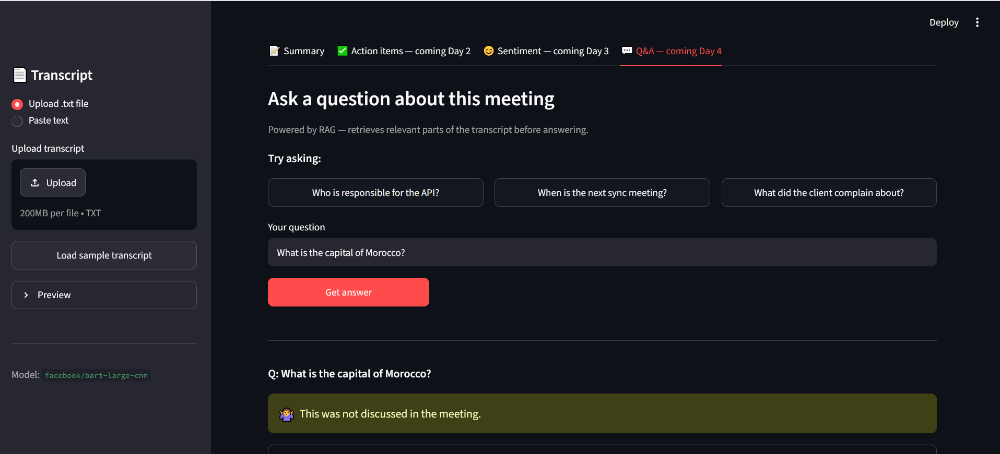

# 🎙️ AI Meeting Assistant

A Streamlit web app that analyzes meeting transcripts using NLP and RAG.

## Features
- **Summary** — concise overview using `facebook/bart-large-cnn`
- **Action items** — rule-based extraction with hybrid NLP cleaning
- **Sentiment analysis** — per-speaker tone with `cardiffnlp/twitter-roberta-base-sentiment-latest`
- **Q&A** — RAG pipeline (FAISS + sentence-transformers + flan-t5-large)

## Demo


## Setup
```bash
git clone https://github.com/YOUR_USERNAME/meeting-assistant
cd meeting-assistant
python -m venv venv
source venv/bin/activate      # Windows: venv\Scripts\activate
pip install -r requirements.txt
streamlit run app.py
```

## Models used
| Feature | Model | Source |
|---|---|---|
| Summarization | facebook/bart-large-cnn | HuggingFace |
| Action extraction | Rule-based + google/flan-t5-large | HuggingFace |
| Sentiment | cardiffnlp/twitter-roberta-base-sentiment-latest | HuggingFace |
| Embeddings | all-MiniLM-L6-v2 | sentence-transformers |
| Q&A generation | google/flan-t5-large | HuggingFace |

## Project structure
        meeting-assistant/
        ├── app.py                  ← Streamlit UI
        ├── src/
        │   ├── summarizer.py
        │   ├── action_extractor.py
        │   ├── sentiment.py
        │   └── rag.py
        ├── config/config.yaml      ← all model names and params
        ├── data/sample_transcripts/
        └── requirements.txt

## Limitations
- Action extraction relies on English keywords and "Name: text" format
- Sentiment model trained on Twitter — may misclassify formal business language  
- RAG Q&A works best on short, structured transcripts
- All models run on CPU by default — GPU recommended for faster inference
